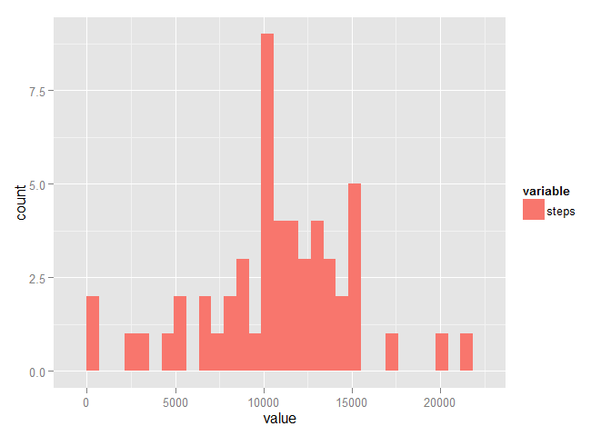
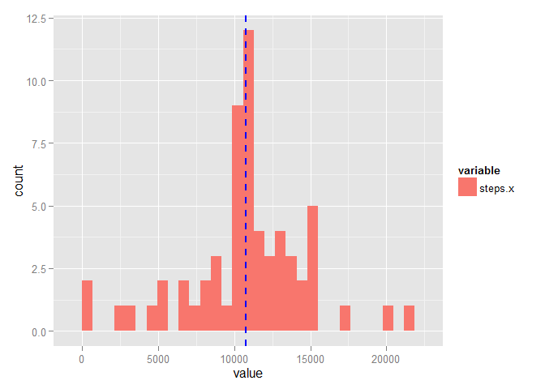

# Peer Assignment 1
Bhawna G. Panwar  
Saturday, July 19, 2014  

###Part0: Load and preprocess the data

```r
          ##Load the library for graphs    
            require(ggplot2)
            require(reshape2)
          ## Load and preprocess the data
          ## Read steps from file activity.csv 
            mydata <- read.csv("activity.csv", header = TRUE)
```
###Part1: The Mean total number of steps taken per day


```r
          ## Extract total steps from a dataframe
            totalsteps <- aggregate(steps ~ date, data=mydata, FUN=sum, na.rm=TRUE)

          ##Make histogram of the total number of steps taken each day
            ggplot(melt(totalsteps), aes(value, fill = variable)) + geom_histogram(position = "dodge") 
```

 

```r
          ##Calculate and report the mean and median total number of steps taken each day
            vectormean <- totalsteps$steps
            mean(vectormean)
```

```
## [1] 10766
```

```r
            median(vectormean)
```

```
## [1] 10765
```

Mean total number of steps per day is 10766

Median total number of steps per day is 10765

###Part2: The Average daily activity pattern


```r
        ##Extract average steps from a dataframe
          avg.steps.byinterval <- aggregate(steps ~ interval, data=mydata, FUN=mean, na.rm=TRUE)

        ## Calculate interval of maximum steps  
        rowofmax <- which.max(avg.steps.byinterval$steps)
        intervalofmaxsteps <- (avg.steps.byinterval$interval[rowofmax])
        intervalofmaxsteps
```

```
## [1] 835
```

```r
        ##Make Time series plot of the 5-minute interval(x-axis) and the average number of steps.
          time.series.steps <- ggplot(avg.steps.byinterval, aes(interval, steps)) + geom_line()
          time.series.steps <- time.series.steps + ggtitle("Average of Steps") + scale_y_continuous(name= "Number of Steps")
          time.series.steps
```

 

The 5- minute interval, on average across all the days in data set, which contains the maximum number of steps is 835 .

###Part3: Following steps were used as strategy for imputing missing data and creating a new dataset

The merge function was used to "join" the original data set with avg.steps.byinterval, thus adding the average value for the interval in a new steps.y column. Then steps.x values for rows with NAs were replaced with values in the steps.y column.


```r
        ##Calculate and report total number of the missing values in the dataset
          count.nas <- length(mydata[is.na(mydata$steps),1])
          count.nas
```

```
## [1] 2304
```

```r
        ##Fill in all the missing values in the dataset
        filldata <- merge(mydata, avg.steps.byinterval, by.x = "interval", by.y = "interval")
        filldata[is.na(filldata$steps.x),2] <- filldata[is.na(filldata$steps.x),4]
      
        ##Extract average steps from a dataframe
        totalsteps.fill <- aggregate(steps.x ~ date, data=filldata, FUN=sum)

        ##Make Histogram of the total number of steps taken each day
        ##Vertical line shows the mean value
        ggplot(melt(totalsteps.fill), aes(value, fill = variable)) + geom_histogram(position = "dodge") + geom_vline(aes(xintercept=median(value)),color="blue", linetype="dashed", size=1)
```

 

```r
        ##Calculate and report the mean and median of the total number of steps per day.
          mean(totalsteps.fill$steps.x)
```

```
## [1] 10766
```

```r
          median(totalsteps.fill$steps.x)
```

```
## [1] 10766
```
The total number of the missing values in the dataset is 2304 .

The results shows that both the mean and median of the total number of steps per day are identical. 
Mean total number of steps per day is 10766 .

Median total number of steps per day is 10766 .
         


###Part4: Activity patterns between weekdays and weekends
  Panel plot of the weekedays and Weekends shows below.

```r
        ## use as.Date and factor function to create weekend data frame      
        z <- weekdays(as.Date(filldata$date), abbreviate = TRUE)
        filldata$weekend <- factor(as.numeric((z == "Sat") | (z == "Sun")), labels = c("weekday", "weekend"))
    

        ##Extract average steps from weekdays and weekend
        weekend.df <- aggregate(steps.x ~ interval + weekend, data=filldata, FUN=mean)
        

        ##Plot the average steps for both Weekend and weekdays
        ts <- ggplot(weekend.df, aes(interval, steps.x)) + geom_line()
        ts <- ts + facet_grid(weekend ~ .) + ggtitle("Mean of Steps for all Weekdays or Weekend") + scale_y_continuous(name= "Number of Steps")
        ts
```

 

Note that the `echo = FALSE` parameter was added to the code chunk to prevent printing of the R code that generated the plot.
